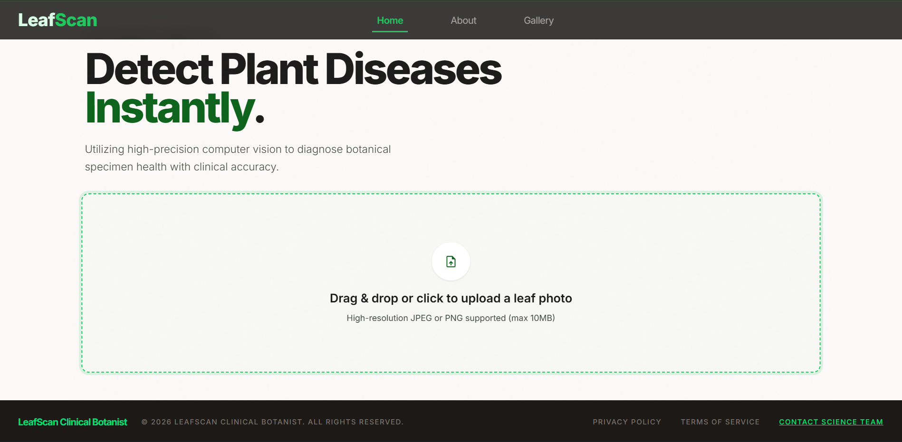
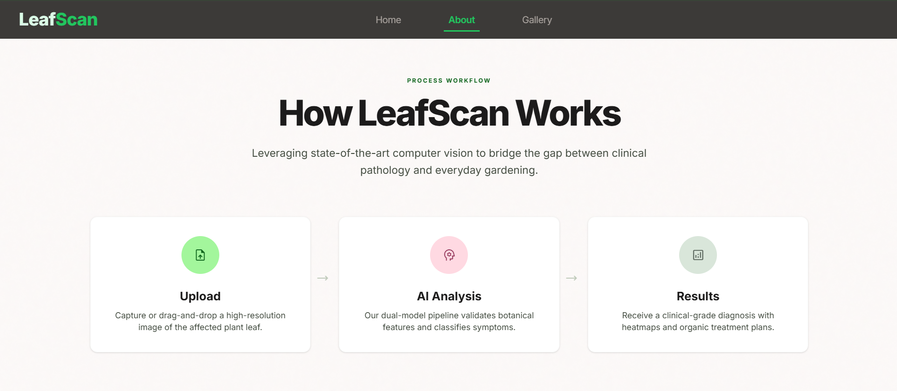
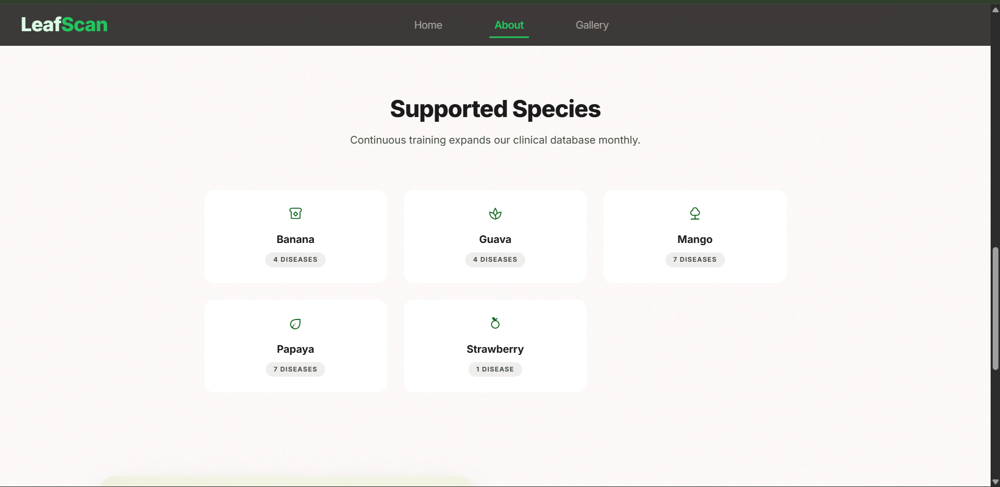
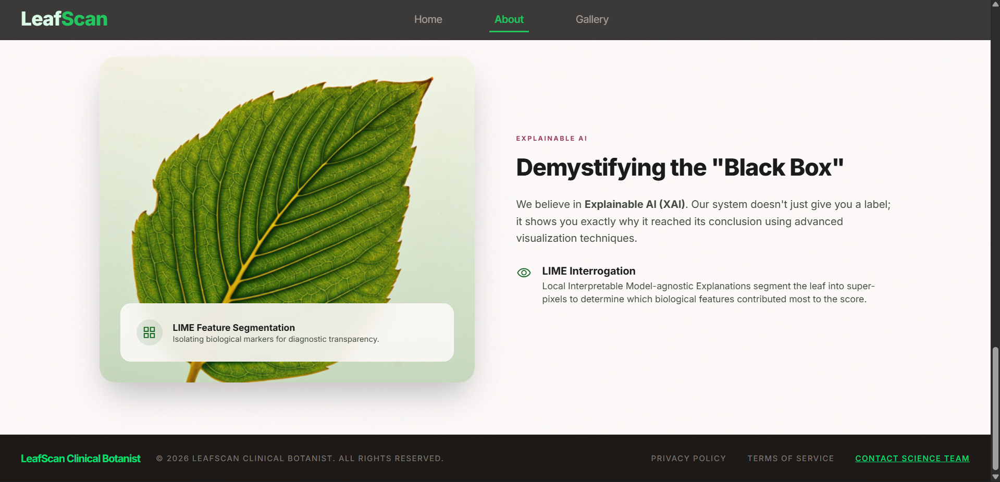
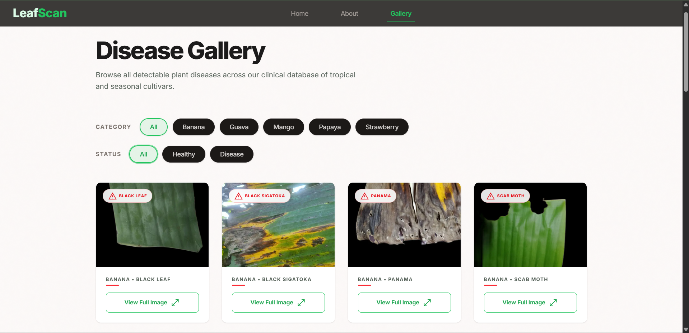
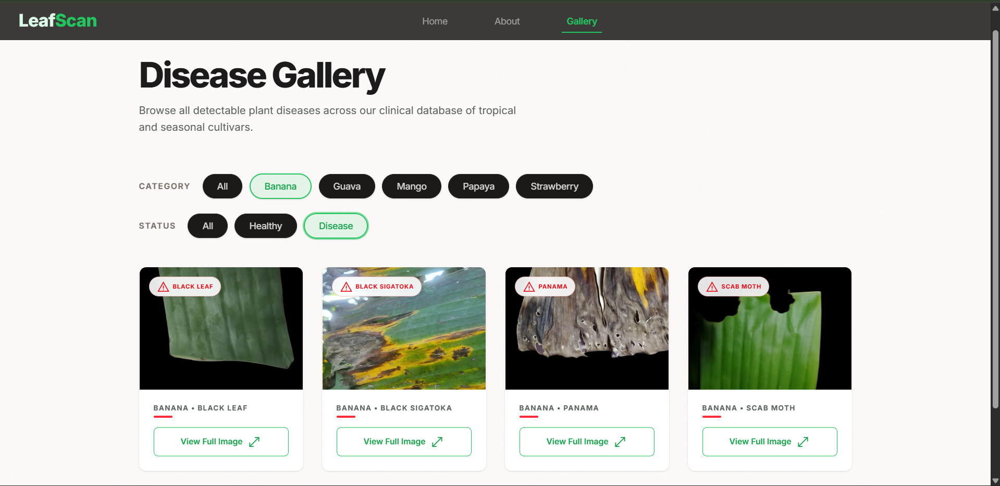
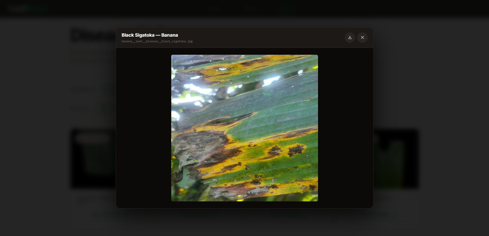
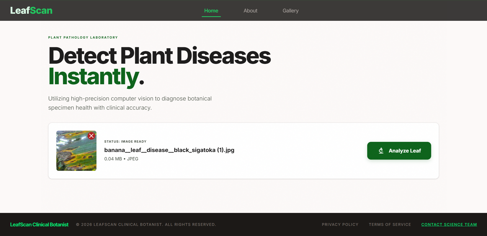
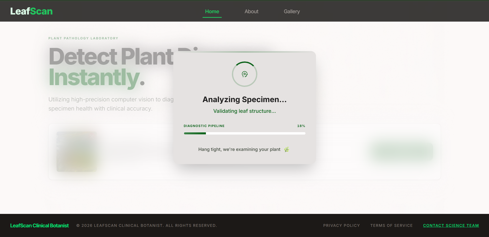
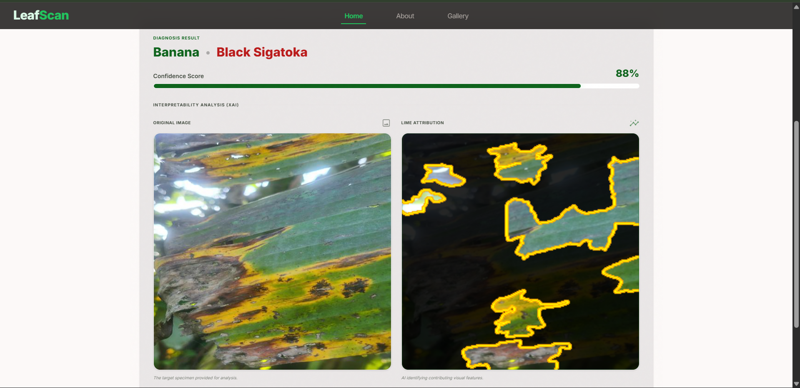

<div align="center">

# 🌿 LeafGuard AI
### Multi-Fruit Leaf Disease Detection System

**An AI-powered web application that detects diseases in fruit tree leaves using a two-stage deep learning pipeline.**

[](https://python.org)
[](https://tensorflow.org)
[](https://nextjs.org)
[](https://fastapi.tiangolo.com)


[Features](#-features) · [Demo](#-demo) · [Tech Stack](#-tech-stack) · [Dataset](#-dataset) · [Models](#ai-models) · [Setup](#-getting-started) 

</div>

---

## 📌 What is LeafGuard AI?

LeafGuard AI is a production-ready web application that helps farmers and agricultural professionals detect diseases in fruit tree leaves instantly. Simply upload a photo of a leaf and the system will:

1. **Validate** that the image actually contains a leaf (rejects irrelevant photos)
2. **Classify** the specific disease — or confirm the leaf is healthy

The system supports **5 fruit types** and can identify **28 disease categories** with high accuracy.

---

## ✨ Features

- 📷 **Upload any image** — the system validates it is a leaf before analyzing
- 🔍 **28-class disease detection** across Banana, Guava, Mango, Papaya, and Strawberry
- 🧠 **Two-stage AI pipeline** — MobileNetV2 validator + EfficientNetB1 classifier
- 💡 **LIME explainability** — visual heatmaps showing which parts of the leaf triggered the prediction
- ⚡ **Fast inference** — results in under 1 minute
- 🌐 **REST API** — easy integration with other apps

---

## 🎬 Demo

### Home Page


### About Page




### Gallery Page

#### Gallery Page --> Apply Filter

#### Gallery Page --> Download


### Prediction




---

##  Project Structure

```
LeafGuard/
├── backend/
│   ├── main.py                        # FastAPI app — API routes & server
│   ├── predictor.py                   # Two-stage inference pipeline
│   ├── lime_explainer.py              # LIME visual explanation generator
│   ├── disease_classes.json           # 28 class names (used by predictor)
│   └── requirements.txt              # Python dependencies
│
├── frontend/
│   ├── app/                           # Next.js pages and routes
│   ├── components/                    # Reusable UI components
│   ├── lib/                           # Utility/helper functions
│   └── public/                        # Static assets (icons, images)
│
└── training/
    ├── model_training_v2.ipynb        # Full training notebook 
```

---

## AI Models

The system uses a **two-stage pipeline** so that non-leaf images are rejected before they reach the disease classifier — preventing incorrect predictions.

### Stage 1 — Leaf Validator
| Property | Detail |
|---|---|
| Architecture | MobileNetV2 (pretrained on ImageNet) |
| Task | Binary classification: Leaf vs Not-a-Leaf |
| Input size | 224 × 224 × 3 |
| Output | Sigmoid probability |
| Fine-tuned layers | Last layers unfrozen |

### Stage 2 — Disease Classifier
| Property | Detail |
|---|---|
| Architecture | EfficientNetB1 (pretrained on ImageNet) |
| Task | 28-class multi-label disease classification |
| Input size | 240 × 240 × 3 |
| Output | Softmax over 28 classes |
| Fine-tuned layers | Last layers unfrozen |

### Training Strategy
Both models use a **two-phase training approach**:
- **Phase 1 (Feature Extraction):** Base model frozen, only the custom head trains at `lr=1e-3`
- **Phase 2 (Fine-tuning):** Top layers unfrozen, full model trains at `lr=1e-5`


---

## 🌱 Dataset

The dataset was **manually collected and curated** by me from various 
public websites and agricultural image sources. All images were hand-picked, 
cleaned, and organized into 28 disease categories across 5 fruit types.

### 📦 Dataset on Kaggle

The full dataset is publicly available on Kaggle, uploaded by me:

[](https://www.kaggle.com/datasets/dp2302/leaf-final)


The complete dataset was divided into two stages:

### 1. Leaf Validation Dataset
Used for training the validator model to determine whether an uploaded image is a leaf or a non-leaf object.

Leaf images included:
- leaf images to determine the given photo is leaf or not
- leaf images from all 28 classes

Non-leaf images included:
- Random real-world non-leaf objects and backgrounds

### 2. Disease Classification Dataset
Used for training the main disease classification model.

The classification dataset contains 28 classes covering diseases and healthy categories of fruits leaf.

The images were manually collected, cleaned, organized, and preprocessed before training.


| Category | Source | Count |
|---|---|---|
| Leaf images | `Leaf/` + `Leaf_New/` folders | 17,319 images |
| Non-leaf images | `Non Leaf/` folder | 5,449 images |
| Disease classes | 5 fruit types | 28 classes |

### Supported Classes (28 total)

<details>
<summary>Click to expand full class list</summary>

**Banana (5 classes)**
- Black Leaf Streak · Black Sigatoka · Panama Disease · Scab Moth · Healthy

**Guava (5 classes)**
- Anthracnose · Canker · Dot Disease · Rust · Healthy

**Mango (8 classes)**
- Anthracnose · Bacterial Canker · Cutting Weevil · Die Back · Gall Midge · Powdery Mildew · Sooty Mould · Healthy

**Papaya (8 classes)**
- Anthracnose · Bacterial Spot · Curl · Mealybug · Mite Disease · Mosaic · Ringspot · Healthy

**Strawberry (2 classes)**
- Damaged · Healthy

</details>

---

## 🛠 Tech Stack

| Layer | Technology |
|---|---|
| **Frontend** | Next.js 14, TypeScript, Tailwind CSS |
| **Backend** | Python, FastAPI |
| **AI Framework** | TensorFlow 2.x / Keras |
| **Validator Model** | MobileNetV2 |
| **Classifier Model** | EfficientNetB1 |
| **Explainability** | LIME (Local Interpretable Model-agnostic Explanations) |
| **Data Processing** | NumPy, scikit-learn |

---

## 🚀 Getting Started

### Prerequisites
- Python 3.10+
- Node.js 18+
- npm or yarn

---

### 📥 Download Trained Models
The `.keras` model files are hosted separately due to size:

| Model | Size | Download |
|---|---|---|
| `leaf_validator_final.keras` | ~25 MB | [Download](https://drive.google.com/uc?export=download&id=1cPsQzXXivPTv0TBapUnkXZWpZOhtLKBy) |
| `disease_classifier_final.keras` | ~63 MB | [Download](https://drive.google.com/uc?export=download&id=1N5QXB6HgdNH62x35PEkI6UZbPglddrJH) |

> After downloading, place both files inside the `backend/` folder.


### Backend Setup

```bash
# 1. Navigate to the backend folder
cd backend

# 2. (Recommended) Create a virtual environment
python -m venv venv
venv\Scripts\activate        # Windows
# source venv/bin/activate   # Mac/Linux

# 3. Install dependencies
pip install -r requirements.txt

# 4. Download the model files (see links above) and place them in backend/

# 5. Start the server
uvicorn main:app --reload
```

The API will be running at **http://localhost:8000**

---

### Frontend Setup

```bash
# 1. Navigate to the frontend folder
cd frontend

# 2. Install dependencies
npm install

# 3. Start the development server
npm run dev
```

Open **http://localhost:3000** in your browser.


---

## ⚙️ How the Inference Pipeline Works

```
User uploads image
        │
        ▼
┌─────────────────────┐
│   Leaf Validator    │  ← MobileNetV2
│  (Is this a leaf?)  │
└─────────────────────┘
        │
   ┌────┴────┐
   │         │
  YES        NO
   │         │
   ▼         ▼
Disease   Return "Not
Classifier  a leaf"
(28 classes)
   │
   ▼
Return disease name
+ confidence score
```

---

## 🧩 Key Implementation Details

**Why two models instead of one?**
A single model trained only on leaves will try to classify any image — even photos of cars or people — as one of the disease categories. The validator stage prevents this entirely.

**How class imbalance is handled:**
The disease dataset has significant imbalance (some classes have 264 images, others just 3). The training code automatically computes class weights and passes them to `model.fit()` so rare diseases are not ignored.


---


## 👤 Author

**Dharm Patel**
- GitHub: [@DharmPatel2302](https://github.com/DharmPatel2302)
- LinkedIn: [Dharm Patel](https://www.linkedin.com/in/dharm-patel-2aa66427b/)

---

